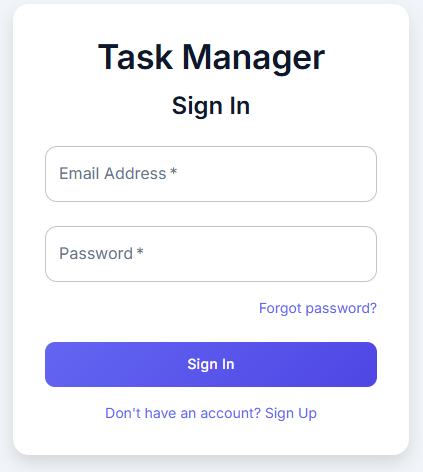
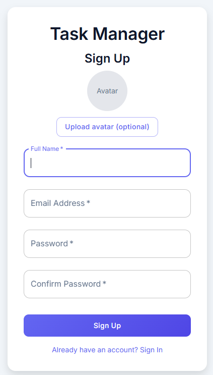
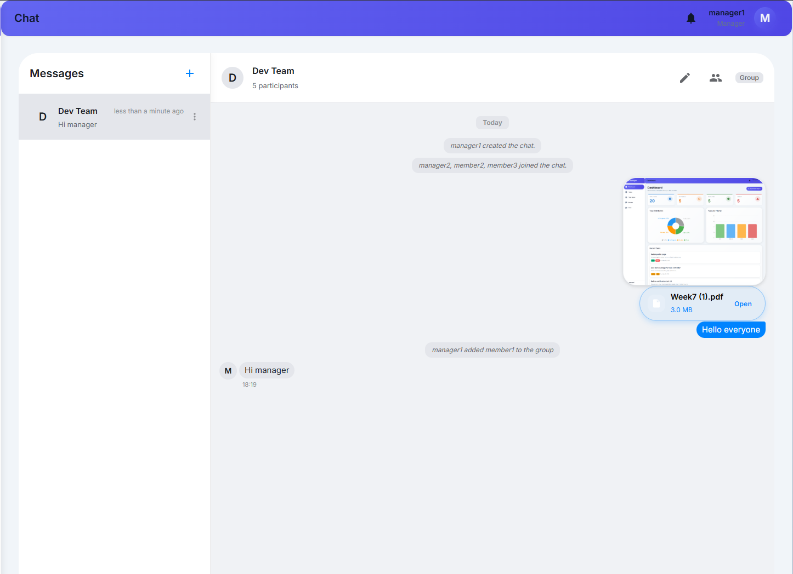
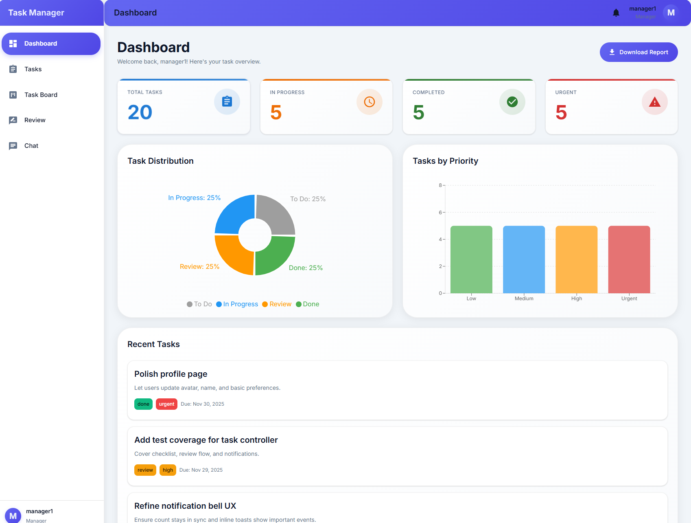
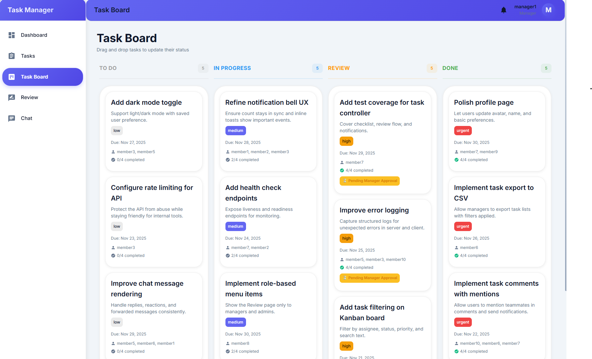
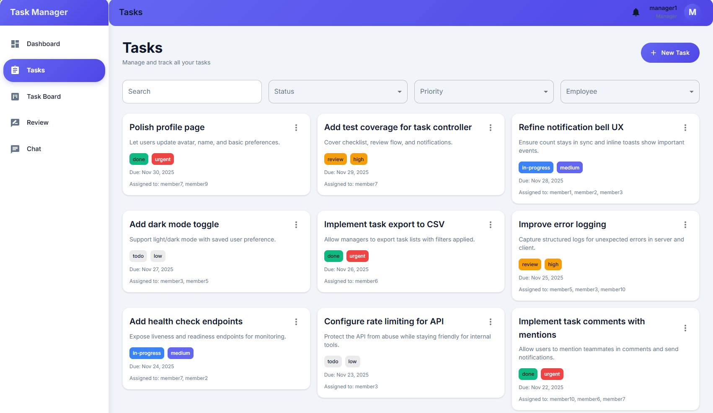
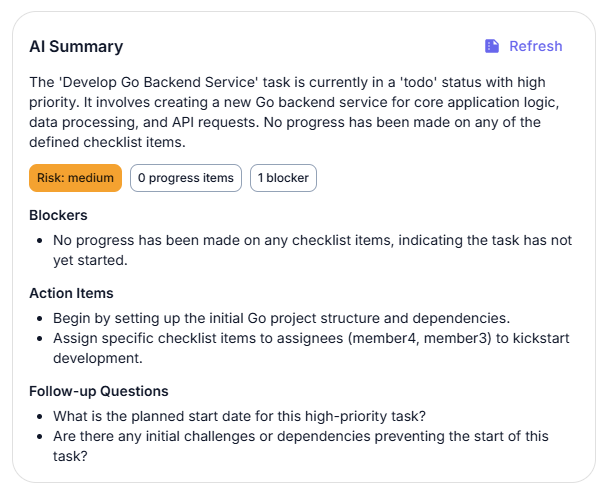
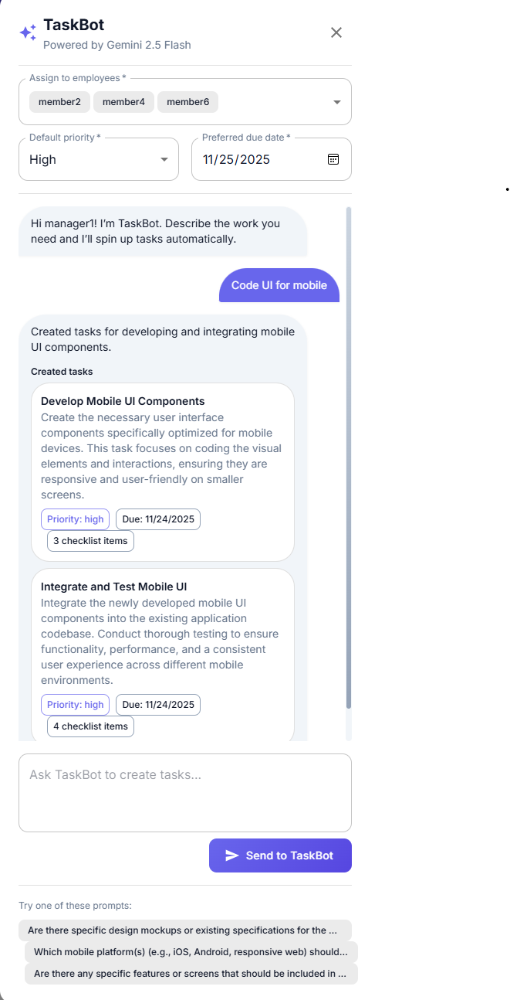

## Task Manager – Full‑Stack Application

A full‑featured task management and collaboration platform built with React, Material‑UI, Node.js/Express, MongoDB, and Socket.IO. The application supports real‑time chat, task management with checklists and review workflows, Kanban boards, and role‑based access control for admins, managers, and members.

### Screenshots

Sign in:



Sign up:



Chat screen:



Manager dashboard:



Task board:



Task list:



AI Task summary:



AI Chat summary:


TaskBot assistant:



Manager review page:


## Features

### Core Features
- **JWT Authentication** – Secure authentication with password reset via OTP
- **Task Management** – Full CRUD operations with attachments, comments, and checklists
- **Kanban Board** – Drag-and-drop task organization with real-time updates
- **AI TaskBot** – Generate fully scoped tasks from natural language using Gemini 2.5 Flash
- **AI Chat Summaries** – Summarize any conversation with a single click via Gemini
- **Real-time Chat** – Direct and group messaging with file/image attachments
- **Role-Based Access Control** – Admin, Manager, and Member roles with different permissions
- **Dashboard** – Statistics, charts, and analytics
- **Advanced Search & Filters** – Search tasks by title, description, status, priority
- **Responsive Design** – Mobile-first design with Material-UI and Tailwind CSS
- **Modern UI** – Clean, modern interface with smooth transitions
- **File Attachments** – Upload and manage files via AWS S3
- **User Avatars** – Optional avatar upload during registration
- **Real-time Notifications** – Live updates via Socket.IO

### Chat Features
- Direct messaging (1‑on‑1)
- Group chats with multiple participants
- File and image attachments
- Message replies
- Emoji reactions
- User mentions (@mentions and @all)
- Read receipts
- Message editing and deletion
- System messages for chat events
- AI-powered chat summaries (Gemini 2.5 Flash)

### Task Features
- Task statuses: To Do, In Progress, Review, Done
- Priority levels: Low, Medium, High, Urgent
- Due dates with timezone handling
- Task assignments (must assign to at least one member)
- Comments and discussions
- Checklists with completion tracking
- AI-assisted task generation via TaskBot with automatic checklists and notifications
- AI-powered task summaries (Gemini) that include attachments, comments, and checklists
- File attachments
- Task archiving
- Task statistics and analytics

### Review Workflow and Permissions

- **Members (employees)**
  - Can update checklist items only on tasks they created or are assigned to.
  - When all checklist items are completed, the task automatically moves to Review.
  - A `task_pending_review` notification is sent to all managers/admins.
  - Members cannot edit title, description, status, priority, due date, assignees, or attachments.

- **Managers/Admins**
  - Can edit all task fields (full CRUD).
  - Have access to the `/review` page, which lists all tasks with status `review`.
  - From the Review page they can:
    - Approve a task, moving it from Review to Done.
      - This sends a `task_approved` notification to all assigned members.
    - Reject a task, moving it from Review back to In Progress.
      - This sends a `task_rejected` notification to all assigned members.

- **Notifications**
  - `task_pending_review` – sent to managers/admins when a member completes all checklist items and the task moves to Review.
  - `task_approved` – sent to assigned members when a manager approves a task from Review to Done.
  - `task_rejected` – sent to assigned members when a manager sends a task back from Review to In Progress.
  - Notification count is maintained on the backend and synchronized on the frontend via:
    - `GET /api/notifications` (returns notifications and `unreadCount`)
    - `GET /api/notifications/unread-count`
    - `PUT /api/notifications/:id/read`
    - `PUT /api/notifications/read-all`
    - `DELETE /api/notifications/:id`

## Project Structure

```
TaskManager/
├── client/                      # React frontend
│   ├── src/
│   │   ├── components/          # Reusable components
│   │   │   ├── Chat/           # Chat components (ChatList, MessageList, etc.)
│   │   │   ├── Common/         # Common components (Loading, etc.)
│   │   │   ├── Dashboard/      # Dashboard components
│   │   │   ├── Layout/         # Layout components (Sidebar, Header)
│   │   │   └── Tasks/          # Task-related components
│   │   ├── context/            # React Context providers
│   │   │   ├── AuthContext.jsx
│   │   │   ├── SocketContext.jsx
│   │   │   └── TaskContext.jsx
│   │   ├── hooks/              # Custom React hooks
│   │   ├── pages/              # Page components
│   │   │   ├── Auth/           # Authentication pages
│   │   │   ├── Chat/           # Chat page
│   │   │   ├── Dashboard/      # Dashboard page
│   │   │   ├── Kanban/         # Kanban board page
│   │   │   ├── Profile/        # Profile page
│   │   │   └── Tasks/          # Tasks page
│   │   ├── services/           # API service functions
│   │   └── styles/             # Theme and global styles
│   └── public/                 # Static files
│
├── server/                     # Node.js/Express backend
│   ├── src/
│   │   ├── config/             # Configuration files
│   │   │   ├── database.js     # MongoDB connection
│   │   │   ├── jwt.js          # JWT configuration
│   │   │   └── redis.js        # Redis configuration
│   │   ├── controllers/        # Route controllers
│   │   │   ├── auth.js         # Authentication controller
│   │   │   ├── chat.js         # Chat controller
│   │   │   ├── task.js         # Task controller
│   │   │   ├── user.js         # User controller
│   │   │   └── project.js      # Project controller
│   │   ├── middleware/         # Express middleware
│   │   │   ├── auth.js         # Authentication middleware
│   │   │   ├── error.js        # Error handling
│   │   │   └── validation.js   # Request validation
│   │   ├── models/             # MongoDB models
│   │   │   ├── User.js
│   │   │   ├── Task.js
│   │   │   ├── Chat.js
│   │   │   ├── Message.js
│   │   │   └── Project.js
│   │   ├── routes/             # API routes
│   │   ├── sockets/            # Socket.IO handlers
│   │   ├── utils/              # Utility functions
│   │   │   ├── s3Upload.js     # AWS S3 upload utilities
│   │   │   ├── email.js        # Email sending (SendGrid)
│   │   │   └── messageFormatter.js
│   │   ├── app.js              # Express app setup
│   │   └── server.js           # Server entry point
│   ├── scripts/                # Utility scripts
│   │   ├── createManager.js    # Create manager/admin accounts
│   │   ├── generateTasks.js    # Generate test task data
│   │   └── generateChats.js    # Generate test chat data
│   ├── test/                   # Test files
│   └── .env                    # Environment variables
│
└── docker-compose.yml          # Docker Compose configuration
```

## Getting Started

### Prerequisites

- **Node.js** 20+ and npm
- **MongoDB** (local installation or MongoDB Atlas)
- **Redis** (optional, for caching)
- **AWS S3** (for file storage) - Optional but recommended
- **SendGrid** (for email) - Optional, for password reset

### Installation

1. **Clone the repository:**
```bash
git clone https://github.com/BachNg311/TaskManager.git
cd TaskManager
```

2. **Install dependencies:**
```bash
# Install root dependencies (if any)
npm install

# Install server dependencies
cd server
npm install

# Install client dependencies
cd ../client
npm install
```

3. **Set up environment variables:**

**Server** (`server/.env`):
```env
NODE_ENV=development
PORT=5000
MONGODB_URI=YOUR_MONGODB_URI
JWT_SECRET=your-super-secret-jwt-key-change-this-in-production
JWT_EXPIRE=7d

# Redis (optional)
REDIS_HOST=localhost
REDIS_PORT=6379
REDIS_PASSWORD=

# Frontend URL
FRONTEND_URL=http://localhost:3000

# AWS S3 (for file uploads)
AWS_ACCESS_KEY_ID=your-aws-access-key
AWS_SECRET_ACCESS_KEY=your-aws-secret-key
AWS_REGION=us-east-1
AWS_S3_BUCKET_NAME=your-bucket-name

# SendGrid (for email/password reset)
SENDGRID_API_KEY=your-sendgrid-api-key
SENDGRID_FROM_EMAIL=noreply@yourdomain.com

# Google Gemini (TaskBot)
GEMINI_API_KEY=your-gemini-api-key
GEMINI_MODEL=gemini-2.0-flash
```

**Client** (`client/.env`):
```env
REACT_APP_API_URL=http://localhost:5000/api
```

4. **Start MongoDB:**
```bash
# If using local MongoDB
mongod

# Or use MongoDB Atlas (cloud)
# Update MONGODB_URI in .env
```

5. **Start the development servers:**

**Option 1: Run both together (if root package.json has scripts)**
```bash
# From root directory
npm run dev
```

**Option 2: Run separately**
```bash
# Terminal 1 - Backend
cd server
npm run dev

# Terminal 2 - Frontend
cd client
npm start
```

The application will be available at:
- **Frontend:** http://localhost:3000
- **Backend API:** http://localhost:5000/api

## Creating Manager/Admin Accounts

**Important:** Regular registration creates 'member' accounts only. To create manager or admin accounts, use the provided script:

```bash
cd server

# Create a manager account
npm run create-manager manager@example.com password123 manager

# Create an admin account
npm run create-manager admin@example.com password123 admin
```


## Generating Test Data

The project includes scripts to generate test data for development and testing:

### Generate Tasks
```bash
cd server
npm run generate-tasks
```
This will:
- Create up to 20 test users (if needed)
- Generate 1000 realistic tasks with varied data
- All tasks will have at least one assignee
- Includes attachments, comments, checklists, and tags

### Generate Chats and Messages
```bash
cd server
npm run generate-chats
```
This will:
- Create up to 20 test users (if needed)
- Generate 50 direct chats
- Generate 30 group chats
- Create 5-100 messages per chat with:
  - Text messages
  - File/image attachments
  - Replies
  - Reactions
  - Mentions
  - Read receipts

## Docker Deployment

1. **Build and start all services:**
```bash
docker-compose up -d
```

2. **Access the application:**
- Frontend: http://localhost:3000
- Backend API: http://localhost:5000
- MongoDB: localhost:27017 or MONGODB_URI
- Redis: localhost:6379

## 📡 API Endpoints

### Authentication
- `POST /api/auth/register` - Register new user (creates member account)
- `POST /api/auth/login` - Login user
- `GET /api/auth/me` - Get current user
- `POST /api/auth/forgot-password` - Request password reset (sends OTP)
- `POST /api/auth/reset-password` - Reset password with OTP
- `POST /api/auth/upload-avatar` - Upload user avatar

### Tasks
- `GET /api/tasks` - Get all tasks (with filters: status, priority, assignedTo, search)
- `GET /api/tasks/:id` - Get single task
- `POST /api/tasks` - Create task (Manager/Admin only, requires assignedTo)
- `PUT /api/tasks/:id` - Update task
- `DELETE /api/tasks/:id` - Delete task
- `POST /api/tasks/:id/comments` - Add comment to task
- `PUT /api/tasks/:id/status` - Update task status
- `PUT /api/tasks/:id/priority` - Update task priority
- `GET /api/tasks/stats` - Get task statistics
- `POST /api/tasks/:taskId/attachments` - Upload task attachment
- `GET /api/tasks/attachments/download` - Download task attachment (signed URL)

### AI TaskBot
- `POST /api/ai/task-bot` - Generate and create tasks automatically from a natural-language prompt (Manager/Admin only)

### AI Chat Summaries
- `POST /api/ai/chat-summary` - Summarize the latest portion of a chat using Gemini (available to chat participants)

### AI Task Summaries
- `POST /api/ai/task-summary` - Summarize a task (metadata, comments, checklist, attachments) using Gemini

### Chats
- `GET /api/chats` - Get all user chats
- `GET /api/chats/direct/:userId` - Get or create direct chat
- `POST /api/chats/group` - Create group chat
- `GET /api/chats/:id` - Get single chat
- `POST /api/chats/:id/leave` - Leave chat
- `DELETE /api/chats/:id/participants/:userId` - Remove participant
- `POST /api/chats/:id/participants` - Add participant
- `GET /api/chats/:id/messages` - Get chat messages (paginated)
- `POST /api/chats/:chatId/attachments` - Upload chat attachment

### Users
- `GET /api/users` - Get all users (Admin/Manager only)
- `GET /api/users/:id` - Get single user
- `PUT /api/users/:id` - Update user


## 🔐 Role-Based Access Control

### Admin
- Full access to all features
- Can create tasks and projects
- Can view and manage all users
- Can access all chats

### Manager
- Can create tasks and projects
- Can view and manage users
- Can access all chats
- Can assign tasks to members

### Member
- Can view and update assigned tasks
- Cannot create tasks or projects
- Can participate in chats
- Can view projects they're part of

## UI/UX Features

- **Modern Theme:** Indigo/purple color scheme with gradients
- **Responsive Design:** Works on mobile, tablet, and desktop
- **Smooth Animations:** Transitions and hover effects
- **Dark Mode Ready:** Theme structure supports dark mode
- **Accessibility:** Focus states and keyboard navigation
- **Custom Scrollbars:** Styled scrollbars for better UX

## Testing

Run tests:
```bash
cd server
npm test
```

Run tests with coverage:
```bash
npm test -- --coverage
```

## Technologies

### Frontend
- **React** 18.3.1 - UI library
- **Material-UI (MUI)** 6.1.2 - Component library
- **Tailwind CSS** 3.4.1 - Utility-first CSS
- **React Router** 6.26.1 - Routing
- **Socket.IO Client** 4.8.1 - Real-time communication
- **Axios** 1.7.4 - HTTP client
- **@hello-pangea/dnd** 18.0.1 - Drag and drop
- **Recharts** 2.10.3 - Charts and graphs
- **Date-fns** 3.0.6 - Date utilities

### Backend
- **Node.js** - Runtime environment
- **Express.js** 4.18.2 - Web framework
- **MongoDB** with **Mongoose** 8.0.3 - Database
- **Socket.IO** 4.6.1 - Real-time communication
- **JWT** (jsonwebtoken) 9.0.2 - Authentication
- **bcryptjs** 2.4.3 - Password hashing
- **AWS SDK** 2.1692.0 - S3 file storage
- **Multer & Multer-S3** - File upload handling
- **Nodemailer** 6.9.7 - Email sending (SendGrid)
- **Redis** 4.6.12 - Caching (optional)
- **Express Validator** 7.0.1 - Request validation
- **Helmet** 7.1.0 - Security headers
- **Morgan** 1.10.0 - HTTP logging

## Scripts

### Server Scripts
```bash
npm start              # Start production server
npm run dev            # Start development server with nodemon
npm test               # Run tests
npm run test:watch     # Run tests in watch mode
npm run create-manager # Create manager/admin account
npm run generate-tasks # Generate 1000 test tasks
npm run generate-chats # Generate test chats and messages
```

### Client Scripts
```bash
npm start              # Start development server
npm run build          # Build for production
npm test               # Run tests
```

## Key Features Implementation

### Task Management
- Tasks must be assigned to at least one member
- Tasks can have multiple assignees
- Support for attachments, comments, and checklists
- Real-time status updates via Socket.IO
- Drag-and-drop on Kanban board
- TaskBot uses Gemini 2.5 Flash to transform prompts into scoped tasks with due dates and checklists

### Chat System
- Direct messaging (1-on-1)
- Group chats with admin controls
- File and image attachments
- Message replies and reactions
- User mentions (@mentions)
- Read receipts
- System messages for chat events

### File Storage
- AWS S3 integration for file storage
- Signed URLs for secure file access
- Support for images, documents, videos, and audio
- Automatic cleanup when files are deleted

### Authentication
- JWT-based authentication
- Password reset via OTP (6-digit code, 5-minute expiry)
- Optional avatar upload during registration
- Role-based access control

## Known Issues & Notes

- AWS SDK v2 is in maintenance mode (consider migrating to v3)
- Some tests may need updates for new validation requirements
- Redis is optional but recommended for production

## Contributing

1. Fork the repository
2. Create your feature branch (`git checkout -b feature/XYZ`)
3. Commit your changes (`git commit -m 'Add some XYZ'`)
4. Push to the branch (`git push origin feature/XYZ`)
5. Open a Pull Request

## License

This project is licensed under the MIT License.

## Acknowledgments

- Material-UI for the component library
- Socket.IO for real-time communication
- MongoDB for the database
- AWS S3 for file storage

---

**Built with using React, Node.js, and MongoDB**
